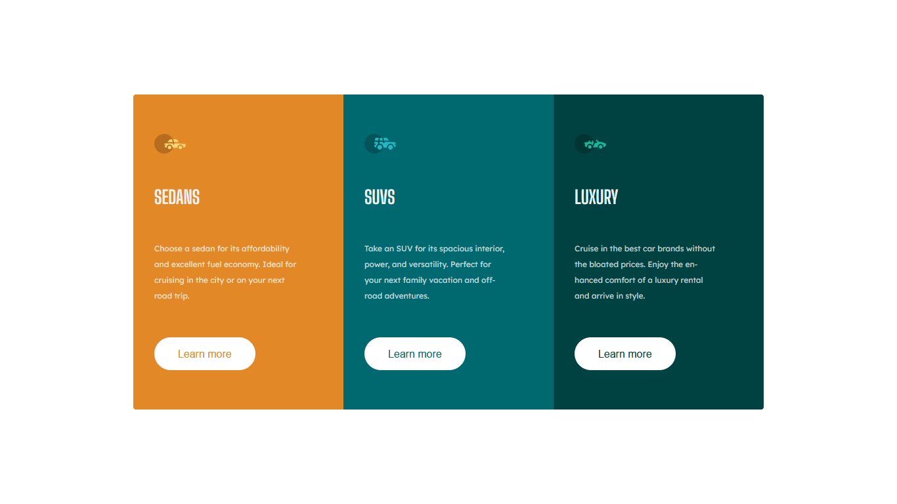

# Frontend Mentor - 3-column preview card component solution

This is a solution to the [3-column preview card component challenge on Frontend Mentor](https://www.frontendmentor.io/challenges/3column-preview-card-component-pH92eAR2-). Frontend Mentor challenges help you improve your coding skills by building realistic projects. 

## Table of contents

- [Overview](#overview)
  - [The challenge](#the-challenge)
  - [Screenshot](#screenshot)
  - [Links](#links)
- [My process](#my-process)
  - [Built with](#built-with)
  - [What I learned](#what-i-learned)
  - [Continued development](#continued-development)
  - [Useful resources](#useful-resources)
- [Author](#author)

## Overview

### The challenge

Users should be able to:

- View the optimal layout depending on their device's screen size
- See hover states for interactive elements

### Screenshot

### Links

- Solution URL: [Add solution URL here](https://github.com/ignaciofigueroadev/3-Column-preview-card-component)
- Live Site URL: [Add live site URL here](https://your-live-site-url.com)

## My process

### Built with

- Semantic HTML5 markup
- SASS
- BEM
- Flexbox
- Mobile-first workflow

### What I learned

I learned to install SASS on my project and use variables, and use nesting.

### Continued development

I want to learn more of SASS and improve my skills with

### Useful resources

- [🚨 Variables en SASS y SCSS | SASS CSS: Tutorial en español ✅](https://www.youtube.com/watch?v=eoAwVWeQf6U&list=PLJpymL0goBgFAUYDei7CoJCiHjcmgioUt&index=3) - This helped me for know to use variables. I really liked this pattern and will use it going forward.
- [Te enseño SASS en 40 MINUTOS! (curso practico)](https://www.youtube.com/watch?v=eoAwVWeQf6U&list=PLJpymL0goBgFAUYDei7CoJCiHjcmgioUt&index=3) - This is an amazing video which helped me to install and understand the basics of SASS. I'd recommend it to anyone still learning this concept.

## Author
- Frontend Mentor - [@ignaciofigueroadev](https://www.frontendmentor.io/profile/ignaciofigueroadev)

